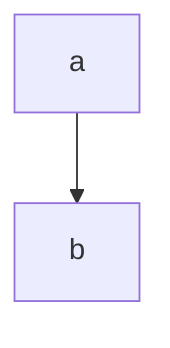

# This

[toc]

is a

## Test page

```javascript
if (true) {
    return false;
}
```
## Test section

howdy

### Test nesting!

[toc]

#### Test nesting further!

Some word or something that needs explaining[^1].

[^1]:
   PADDED
   does this do multiline?

[^1]:
UNPADDED

[^1]: Inline padded?

[^^1] refback?

$$\texttt{Inline }\LaTeX$$



Using:
showdown
katex
showdown-katex: https://obedm503.github.io/showdown-katex/
showdown-toc: https://github.com/ravisorg/showdown-toc
showdown-footnotes: https://github.com/halbgut/showdown-footnotes
IBM Plex Mono
mermaid : mermaid.js.org

