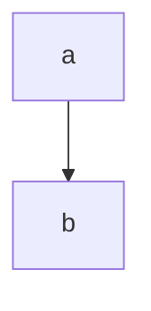

# This

[toc]

is a

## Test page

```javascript
if (true) {
    return false;
}
```
## Test section

This thing has a ||spoiler please do not read|| spoiler.

||

## What about

a bunch of content

that lives within a spoiler?

||

Some text || with a thingy

More text with a || thingy

One paragraph || that just  
happens to have multiline || thingy

## what about || spoiler || header?!

## what about || spoiler|| header?!

||multi
line
spoilers  
even  
if  
there  
should be line breaks||

howdy

> block
> quote
> > testing is going
> > on here

:smile

> [!note] This is a note callout
> 
> Content of the note callout.

---

> [!warning-] Collapsible Warning (starts collapsed)
> 
> This warning starts collapsed.
> 
> ```
> This is a code block
> ```

---

> [!tip+] Expandable Tip (starts expanded)
> 
> This tip starts expanded but can be collapsed.

---

> [!custom] Custom Callout with Nested Content
> 
> This callout has nested content:
> > [!info-] Nested Info
> > 
> > This is nested information.

---

> [!spoiler-]
> 
> Hazel is a goober

---

> [!warning+]
>
> Here's one that should use classname as a title

### Test nesting!

[toc]

#### Test nesting further!

Some word or something that needs explaining[^1].

test2 this is another reference to the same footnote [^1]

this is a link to the second footnote[^2] another one

[^1]:
   PADDED  
   does this do multiline?


[^namegohere]: asdf
    asdf  
    multiline without starting with newline  
    `inlinecode`  
    Another line  
    ```javascript
    // SOME CODE HERE!!!!
    even more code
    code code code
    ```

[^2]: inline 

[^3]: Inline again

$$\texttt{Inline }\LaTeX$$



Using:
showdown
katex
showdown-katex: https://obedm503.github.io/showdown-katex/
showdown-toc: https://github.com/ravisorg/showdown-toc
IBM Plex Mono
mermaid : mermaid.js.org

