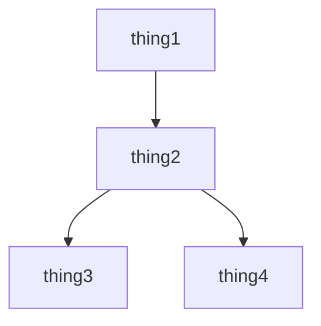

# BlinkMD

A markdown-based static site framework with no server-side rendering or build pipelines required.

[toc]

## How does this thing work?

A simple webpage is loaded with javascript.
The query portion of the URL is used to describe which sub-site page you are interested in.
A corresponding mardown file is fetched from the server and converted on the client side.
All rendering and processing is done by the client. The server is merely a file server.

## What is it good for?

- Extremely simple static websites. I already take all of my notes in markdown format so I wanted an easy way to make them accessible online.
- People who are lazy and just want something that runs with minimal dependencies.
- Avoiding complex dev environments or build pipelines. It only requires a file server.

## What is it bad for?

- SEO (Many web crawlers ignore javascript and the link format is not crawler friendly.)
- Anything that requires bi-directional communication.

## Features

[toc]

### Markdown

All of the page content is handled in markdown files. Check the github repo for an example of what the directory structure is like.

### Table of contents

Simply add [\toc] to a section to have it generate a table of contents.
Right now, only a single level of depth is supported.

You can type `[\toc]` to escape it.

> [!todo]
> 
> I think this is broken right now inside of code blocks.

### Spoiler tags

If you have some kind of ||secret information||, you can obscure it with a clickable box by surrounding it in pipes.
If it is inside of a pre or code block, it is ignored.

```
||spoiler here||
```

### Wiki-style linking for internal links

```
[[page/path]]
[[page/path|alternate display text]]
```


> [!todo]
> 
> I think this is broken right now inside of code blocks.


### Footnotes

You can easily add footnotes[^1] into your text.

They can even have descriptive names if you are into that sort of thing[^formatted].

If you refer to a footnote[^1] multiple times, then each[^1] instance gets a unique backlink!

> [!todo]
>
> describe format

### Callouts

> [!todo]
>
> describe format

### LaTeX (via KaTeX)

You can display math inline $y=mx+b$ .

You can also display it in a block:

$$\sum{\frac{x}{x}}$$

$$\texttt{Inline }\LaTeX$$

$\texttt{Inline }\LaTeX$

> [!todo]
> 
> Another one that seems to be broken :( 

### Mermaid diagrams


---

## Footnotes

[^1]: Footnote description!

[^formatted]: Footnotes can even have names.  
    And they support multi-line content.  
    Even better, you can do some formatted content.
    ```
    efficientFunc() {
        while(true) {
            efficientFunc();
        }
    }
    ```

-----
OLD STUFF

[[docs/advanced-features]]

[[docs/advanced-features|copy wikipedia formatting baby]]

Using:
showdown
katex
showdown-katex: https://obedm503.github.io/showdown-katex/
showdown-toc: https://github.com/ravisorg/showdown-toc
IBM Plex Mono
mermaid : mermaid.js.org

