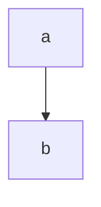

# This

[toc]

is a

## Test page

```javascript
if (true) {
    return false;
}
```
## Test section

howdy

### Test nesting!

[toc]

#### Test nesting further!

Some word or something that needs explaining[^1].

test2 this is another reference to the same footnote [^1]

this is a link to the second footnote[^2] another one

[^1]:
   PADDED  
   does this do multiline?


[^namegohere]: asdf
    asdf  
    multiline without starting with newline  
    `inlinecode`  
    Another line  
    ```javascript
    // SOME CODE HERE!!!!
    even more code
    code code code
    ```

[^2]: inline 

[^3]: Inline again

$$\texttt{Inline }\LaTeX$$



Using:
showdown
katex
showdown-katex: https://obedm503.github.io/showdown-katex/
showdown-toc: https://github.com/ravisorg/showdown-toc
showdown-footnotes: https://github.com/halbgut/showdown-footnotes
IBM Plex Mono
mermaid : mermaid.js.org

